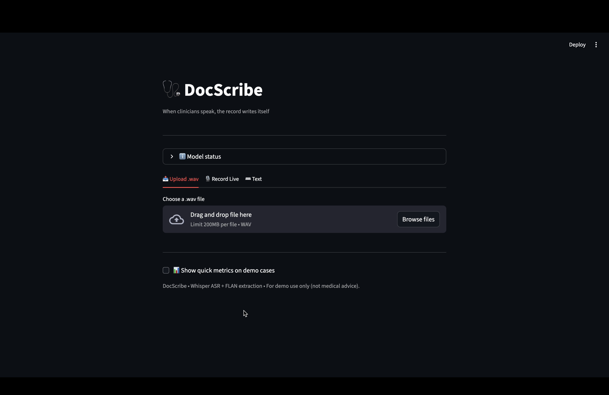

# 🧠 DocScribe — Voice to Structured Clinical Notes  
**Gator Hack IV | AI in Healthcare**

> “When clinicians speak, the record writes itself.”  
> *DocScribe* transforms clinician voice input into structured medical documentation — generating clean, explainable, and EMR-ready notes in seconds.

---

## 🎥 Demo Video

[](https://youtu.be/1QC1WcAI1aY "DocScribe Demo — When clinicians speak, the record writes itself")

## 🌟 Overview

Healthcare professionals spend up to **40–50%** of their workday documenting care.  
**DocScribe** reduces this burden by using AI to automatically:

- 🎙️ **Transcribe** spoken diagnostic reasoning (via Whisper)  
- 🧩 **Extract** structured fields like diagnosis, orders, and plan (via Flan-T5)  
- 📋 **Generate** standardized SOAP notes and patient summaries  
- 🔍 **Highlight** transcript phrases that support each section  
- 📤 **Export** ready-to-review notes in JSON, Markdown, or PDF  

---

## 🧱 Architecture

```text
🎤 Voice Input (Clinician Dictation)
     ↓ Whisper (ASR)
📝 Transcript (editable)
     ↓ Flan-T5 Extraction (Few-shot prompt)
{ chief_complaint, assessment, diagnosis[], orders[], plan[], follow_up }
     ↓
📋 Note Composer (SOAP + Patient Summary)
     ↓
🔍 Span Highlighter → Traceable Output
     ↓
⬇ Export (JSON / PDF / Markdown)
```
---

## 🧠 Core Features

| Feature | Description |
|:--------|:-------------|
| 🎙️ **Speech-to-Text** | Whisper converts spoken clinician dictation into text |
| 🧩 **Structured Extraction** | Flan-T5 extracts a JSON note with precise clinical fields |
| 📋 **SOAP Note Generator** | Automatically formats notes into **S/O/A/P** sections |
| 🔍 **Explainable Output** | Highlights transcript phrases that support each section |
| 📤 **Exports** | Download notes as **JSON**, **Markdown**, or **PDF** |
| ⚖️ **Responsible AI** | Prevents hallucinated medications or unsupported diagnoses |

---

## 🎧 Audio + Voice Demo

- 🎙️ **Upload** `.wav` audio directly  
- 🗣️ **Record via mic** → automatically transcribed with **Whisper**  
- ⚡ **Real-time extraction** → SOAP & JSON appear instantly  
- 💾 **Download notes** as `.txt` or `.json`

---

## 🧪 Model Details

| Component | Model | Source |
|------------|--------|--------|
| **ASR (Speech-to-Text)** | `openai/whisper-base` | [OpenAI Whisper](https://github.com/openai/whisper) |
| **Clinical Extractor** | `google/flan-t5-large` | [Hugging Face Model Hub](https://huggingface.co/google/flan-t5-large) |
| **Evaluation** | Precision / Recall / F1 | Custom local evaluation module |

---

## 📊 Evaluation Example

| Case | Mean F1 |
|:----:|:------:|
| Demo 1 – CAP | 0.78 |
| Demo 2 – Sprain | 0.94 |
| Demo 3 – UTI | 0.50 |
| **Average** | **0.74 F1** |

🧠 **Interpretation:**  
The model demonstrates strong consistency across diverse note types, with particularly high accuracy for structured plans and orders.  
Improvements are achievable with **domain-specific fine-tuning** or **integration with Bio_ClinicalBERT**.

---

## 🧩 Future Extensions

- 🔬 Integrate **Bio_ClinicalBERT** for diagnosis tagging or ICD mapping  
- 🌐 Deploy to **Hugging Face Spaces** or **Streamlit Cloud** for instant demos  
- 📈 Incorporate **real-world EHR datasets** (e.g., MIMIC-III) for testing  
- 🗣️ Add **Voice Activity Detection (VAD)** for auto-stop mic recording  
- 💬 Include **entity highlighting overlays** for explainability  

---

## 💡 Acknowledgments

- [OpenAI Whisper](https://github.com/openai/whisper)  
- [Hugging Face Transformers](https://huggingface.co/docs/transformers)  
- [Streamlit](https://streamlit.io/)  
- [UF AI Days Gator Hack IV 2025](https://ai.ufl.edu) *(Hackathon Submission)*  

---

## 📜 License

**MIT License © 2025 Deepika Sarala Pratapa & Rohit Bogulla**

---

## 👩‍💻 Contributors

| Name | Role | Focus |
|------|------|-------|
| **Deepika Sarala Pratapa** | Co-Developer | Clinical NLP, Evaluation |
| **Rohit Bogulla** | Co-Developer | Whisper ASR, Streamlit, Frontend Integration |


---

## 🌟 Star the Repo

If you found **DocScribe** inspiring or useful, please ⭐ the repo!  
Your support motivates further development — such as **live EMR integration**, **medical summarization**, and **on-device Whisper inference**.

---
